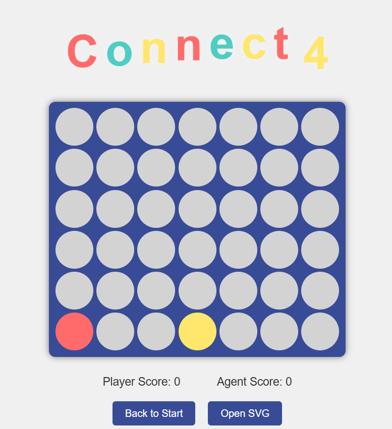

# Connect-4s AI Solver

## Collaborators 👥
- [Armia Joseph: 21010229](https://github.com/Armaritto)
- [Andrew Ashraf: 21010313](https://github.com/AndrewAchraf)
- [Pierre Jack: 21010394](https://github.com/Pierre-Jack)

# GitHub Repository 📁
- [Connect-4s-AI-Solver](https://github.com/Armaritto/Connect-4s-v2.0)
- [Simple-Connect-4s](https://github.com/Armaritto/Connect-4)


# Introduction 🌟

Connect 4 is a two-player game in which the players first choose a color and then take turns
dropping their colored discs from the top into a grid. The pieces fall straight down, occupying
the next available space within the column. The objective of the game is to connect-four of
one’s own discs of the same color next to each other vertically, horizontally, or diagonally. The
two players keep playing until the board is full. The winner is the player having greater
number of connected-fours.

## Problem Statement ❓

It is required to support the following 3 algorithms as options for the AI agent:
• Minimax without alpha-beta pruning
• Minimax with alpha-beta pruning
• Expected Minimax : probability that disc falls in chosen column is 0.6 and 0.4 that it
will into the column on left or right

# Implementation 

## Main Solver Class
The `Solver` class provides various AI strategies for making moves in a Connect-4 game. It includes methods for random move selection, Minimax, Alpha-Beta Pruning, and Expectiminimax algorithms. The class interacts with the `Board` class to evaluate and make moves.

### Global Variables
    - `board`: An instance of the `Board` class representing the current state of the game.

### Main Functions

#### `minimax(self, depth, maximizing)`
- **Role**: Executes the Minimax algorithm to determine the best move.
- **Inputs**: 
  - `depth`: The maximum depth to search in the game tree.
  - `maximizing`: A boolean indicating whether the current move is maximizing or minimizing.
- **Outputs**: 
  - `best_move`: The column index of the best move determined by the algorithm.
- **Flow**: 
  - Calls the `maximize` or `minimize` method from the `Helper` class based on the `maximizing` parameter.
  - Renders the game tree using Graphviz.
  - Determines the best move by comparing the current board state with the child state returned by the algorithm.

#### `expectiminimax(self, depth, maximizing)`
- **Role**: Executes the Expectiminimax algorithm to determine the best move.
- **Inputs**: 
  - `depth`: The maximum depth to search in the game tree.
  - `maximizing`: A boolean indicating whether the current move is maximizing or minimizing.
- **Outputs**: 
  - `random_move`: The column index of the best move determined by the algorithm.
- **Flow**: 
  - Calls the `maximize` or `minimize` method from the `Expectiminimax_solver` class based on the `maximizing` parameter.
  - Renders the game tree using Graphviz.
  - Determines possible moves and selects one based on weighted random sampling.

#### `minimax_with_alpha_beta(self, depth, maximizing)`
- **Role**: Executes the Minimax algorithm with Alpha-Beta Pruning to determine the best move.
- **Inputs**: 
  - `depth`: The maximum depth to search in the game tree.
  - `maximizing`: A boolean indicating whether the current move is maximizing or minimizing.
- **Outputs**: 
  - `best_move`: The column index of the best move determined by the algorithm.
- **Flow**: 
  - Calls the `maximize` or `minimize` method from the `AlphaBetaMinimax` class based on the `maximizing` parameter.
  - Renders the game tree using Graphviz.
  - Determines the best move by comparing the current board state with the child state returned by the algorithm.

#### `get_random_move(self)`
- **Role**: Selects a random valid move.
- **Inputs**: None.
- **Outputs**: 
  - `random_move`: The column index of a randomly selected valid move.
- **Flow**: 
  - Identifies valid columns where a move can be made.
  - Randomly selects one of the valid columns.

### Data Structures and Helper Classes
- `Board` Class: Represents the game board and provides methods to manipulate and query the board state.
- `Helper` Class: Provides utility functions for the Minimax and Alpha-Beta Pruning algorithms.
- `Expectiminimax_solver` Class: Implements the Expectiminimax algorithm.
- `AlphaBetaMinimax` Class: Implements the Minimax algorithm with Alpha-Beta Pruning.

## `Helper` Class

### Overview
The `Helper` class provides utility functions and data structures to support the Minimax and Alpha-Beta Pruning algorithms. It includes methods for rendering the game tree, evaluating board states, and managing the game board.

### Class Attributes

#### `board`
- **Role**: An instance of the `Board` class representing the current state of the game.
- **Type**: `Board`

#### `dot`
- **Role**: An instance of the `Digraph` class from the `graphviz` library used to render the game tree.
- **Type**: `Digraph`

#### `node_counter`
- **Role**: A counter to keep track of the number of nodes in the game tree, also it indicates the current node's ID.
- **Type**: `int`

### Main Functions

#### `__init__(self)`
- **Role**: Initializes the `Helper` class.
- **Inputs**: None.
- **Outputs**: None.
- **Flow**:
  - Initializes the `board` attribute with a new `Board` instance.
  - Initializes the `dot` attribute with a new `Digraph` instance.
  - Initializes the `node_counter` attribute to 0.

#### `board_to_string(self, board_state)`
- **Role**: Converts the board state to a string representation.
- **Inputs**:
  - `board_state`: A 2D list representing the current state of the game board.
- **Outputs**:
  - A string representation of the board state.
- **Flow**:
  - Joins each row of the board state into a string.
  - Joins all rows into a single string separated by newline characters.

#### `add_node(self, node_id, label)`
- **Role**: Adds a node to the game tree.
- **Inputs**:
  - `node_id`: A string representing the node ID.
  - `label`: A string representing the label of the node.
- **Outputs**: None.
- **Flow**:
  - Adds a node to the `dot` attribute with the given ID and label.

#### `add_edge(self, parent_id, child_id)`
- **Role**: Adds an edge between two nodes in the game tree.
- **Inputs**:
  - `parent_id`: A string representing the parent node ID.
  - `child_id`: A string representing the child node ID.
- **Outputs**: None.
- **Flow**:
  - Adds an edge to the `dot` attribute between the parent and child nodes.

#### `heuristic_helper(self, player, board_state)`
- **Role**: Calculates the potential score for a player based on the board state.
- **Inputs**:
  - `player`: A string representing the player ('X' or 'O').
  - `board_state`: A 2D list representing the current state of the game board.
- **Outputs**:
  - The potential score for the player.
- **Flow**:
  - Iterates through the rows, columns, and diagonals of the board state.
  - Counts the number of potential winning positions for the player.
  - Returns the total potential score.

#### `heuristic(self, board_state)`
- **Role**: Evaluates the board state to provide a heuristic value.
- **Inputs**:
  - `board_state`: A 2D list representing the current state of the game board.
- **Outputs**:
  - The heuristic value of the board state.
- **Flow**:
  - Calculates the difference between the agent's and the player's actual scores.
  - Calculates the difference between the agent's and the player's potential scores.
  - Returns the sum of the actual and potential score differences.
  
##### Admissibility and Consistency
  - **Heuristic Definition:** The heuristic is defined as:
  - ```H(state) = (H_actual_AI - H_actual(Player)) + (H_potential(AI) - H_potential(Player))```
    - Where:
        - ````H_actual(AI)```: Number of completed 4s by the AI.
        - ```H_actual(Player)```: Number of completed 4s by the human player.
        - ```H_potential(AI)```: Number of potential 4s by the AI.
        - ```H_potential(Player)```: Number of potential 4s by the human player. 
      
  -**Admissibility Criterion:** A heuristic H(state) is **admissible** if:
  ```H(state) <= H*(state)```
    Where:
      - H(state): The heuristic estimate of the utility value of the state.
      - H*(state): The true utility value (i.e., the actual utility that can be achieved starting from this state). 

  - **Components of the Heuristic:**
    1. **Actual Difference**: ```H_actual(AI) - H_actual(Player)```
       - This term is **exact** and does not overestimate the true utility, as it only reflects already completed 4s.
    2. **Potential Difference**: ```H_potential(AI) - H_potential(Player)```
       - This term conservatively estimates the difference in potential 4s between the AI and the human player.

  - **Why the Heuristic is Admissible:**
      1. **Exactness in ```H_actual```:**
         - The first term ```H_actual(AI) - H_actual(Player)``` is accurate because it directly reflects the current utility difference.
       2. **Conservativeness in ```H_potential```:**
          - The second term ```H_potential(AI) - H_potential(Player)``` measures the difference in potential utility, not the absolute potential for either player. This avoids overestimation.
       3. **Interaction Between Players:**
          - By focusing on **differences**, the heuristic respects the zero-sum nature of the game: one player's gain limits the other's opportunities.
       4. **No Overestimation:**
          - The heuristic does not assume that both players can simultaneously complete conflicting potential 4s, ensuring it remains conservative. 
       5. **Monotonicity:** 
          - As the game progresses:
            - ```H_actual(AI)``` and ```H_actual(Player)``` increase as players complete more lines.
            - ```H_potential(AI)``` and ```H_potential(Player)``` decrease as fewer opportunities remain.
          - The heuristic remains consistent and never overestimates the true utility value.
  - **Conclusion:** 
  - The heuristic: ```H(state) = (H_actual_AI - H_actual(Player)) + (H_potential(AI) - H_potential(Player))``` is **admissible** because:
    1. H_actual accurately measures the current utility difference without overestimation.
    2. H_potential conservatively estimates the potential utility difference.
    3. The heuristic respects the interaction between players and avoids overestimating achievable utility.


### Pseudocode
```python
class Helper:
   method board_to_string(board_state):
       if board_state is None:
           return "No valid moves"
       return '
'.join([''.join(row) for row in board_state])
   
   method add_node(node_id, label):
       dot.node(node_id, label)

   method add_edge(parent_id, child_id):
       dot.edge(parent_id, child_id)

   method heuristic_helper(player, board_state):

       pot_horizontal = 0
       pot_vertical = 0
       pot_diagonal = 0

       for row in board_state:
           for i in range(length(row) - 3):
               window = row[i:i + 4]
               if all(cell == player or cell == 'E' for cell in window):
                   pot_horizontal += 1

       for col in range(7):
           for i in range(3):
               window = [board_state[i + j][col] for j in range(4)]
               if all(cell == player or cell == 'E' for cell in window):
                   pot_vertical += 1

       for i in range(3):
           for j in range(4):
               window = [board_state[i + k][j + k] for k in range(4)]
               if all(cell == player or cell == 'E' for cell in window):
                   pot_diagonal += 1
               window = [board_state[i + k][j + 3 - k] for k in range(4)]
               if all(cell == player or cell == 'E' for cell in window):
                   pot_diagonal += 1

       return pot_horizontal + pot_vertical + pot_diagonal

   method heuristic(board_state):

       h_current = board.check_agent_score() - board.check_player_score()

       h_potential = heuristic_helper('O', board_state) - heuristic_helper('X', board_state)

       return h_current + h_potential
```

### Data Structures and Helper Classes

#### `Board` Class
- **Role**: Represents the game board and provides methods to manipulate and query the board state.
- **Key Methods**:
  - `make_move(column)`: Makes a move in the specified column.
  - `get_children(board_state)`: Returns a list of possible board states after valid moves.
  - `is_full()`: Checks if the board is full.
  - `check_player_score()`: Calculates the score for the player.
  - `check_agent_score()`: Calculates the score for the agent.

#### `Digraph` Class
- **Role**: Represents the game tree and provides methods to add nodes and edges.
- **Key Methods**:
  - `node(node_id, label)`: Adds a node to the graph.
  - `edge(parent_id, child_id)`: Adds an edge between two nodes in the graph.

## Algorithms

### Minimax Algorithm (without pruning)

#### About
The Minimax algorithm is a decision-making algorithm used in two-player games like chess, tic-tac-toe, and Connect-4. It aims to minimize the possible loss for a worst-case scenario. When one player maximizes their score, the other player minimizes it.

#### Main Functions

##### `maximize(self, depth, board_state, parent_id)`
- **Role**: Executes the maximizing part of the Minimax algorithm.
- **Inputs**:
  - `depth`: The maximum depth to search in the game tree.
  - `board_state`: A 2D list representing the current state of the game board.
  - `parent_id`: A string representing the parent node ID.
- **Outputs**:
  - `max_child`: The board state of the best child node.
  - `max_utility`: The utility value of the best child node.
- **Flow**:
  - Checks if the board is full or the depth is 0.
  - If true, creates a leaf node with the heuristic value of the board state.
  - Otherwise, iterates through the children of the board state.
  - Recursively calls the `minimize` method for each child.
  - Updates the maximum utility and best child node.
  - Adds a node to the game tree with the current board state and utility value.

##### `minimize(self, depth, board_state, parent_id)`
- **Role**: Executes the minimizing part of the Minimax algorithm.
- **Inputs**:
  - `depth`: The maximum depth to search in the game tree.
  - `board_state`: A 2D list representing the current state of the game board.
  - `parent_id`: A string representing the parent node ID.
- **Outputs**:
  - `min_child`: The board state of the best child node.
  - `min_utility`: The utility value of the best child node.
- **Flow**:
  - Checks if the board is full or the depth is 0.
  - If true, creates a leaf node with the heuristic value of the board state.
  - Otherwise, iterates through the children of the board state.
  - Recursively calls the `maximize` method for each child.
  - Updates the minimum utility and best child node.
  - Adds a node to the game tree with the current board state and utility value.

#### Pseudocode
```python
   method maximize(depth, board_state, parent_id):
       board.current_player = 'O'
       if board.is_full() or depth == 0:
           node_id = str(node_counter)
           node_counter += 1
           utility = heuristic(board_state)
           label = f'Leaf: Depth {depth}, Utility: {utility} 
{board_to_string(board_state)}'
           add_node(node_id, label)
           add_edge(parent_id, node_id)
           return board_state, utility
       
       
       node_id = str(node_counter)
       node_counter += 1
       label = " "
       
       add_node(node_id, label)
       if parent_id is not None:
           add_edge(parent_id, node_id)

       max_child, max_utility = None, float('-inf')

       for child in board.get_children(board_state):
           _, utility = minimize(depth - 1, child, node_id)

           if utility > max_utility:
               max_child, max_utility = child, utility
       
       label = f'Maximize: Depth {depth}, Utility: {max_utility} 
{board_to_string(board_state)}'
       add_node(node_id, label)

       return max_child, max_utility

   method minimize(depth, board_state, parent_id):
       board.current_player = 'X'
       if board.is_full() or depth == 0:
           node_id = str(node_counter)
           node_counter += 1
           utility = heuristic(board_state)
           label = f'Leaf: Depth {depth}, Utility: {utility} 
{board_to_string(board_state)}'
           add_node(node_id, label)
           add_edge(parent_id, node_id)
           return board_state, heuristic(board_state)
       
       node_id = str(node_counter)
       node_counter += 1
       label = " "
       add_node(node_id, label)
       if parent_id is not None:
           add_edge(parent_id, node_id)

       min_child, min_utility = None, float('inf')

       for child in board.get_children(board_state):
           _, utility = maximize(depth - 1, child, node_id)

           if utility < min_utility:
               min_child, min_utility = child, utility
       
       label = f'Minimize: Depth {depth}, Utility:{min_utility} 
{board_to_string(board_state)}'
       add_node(node_id, label)

       return min_child, min_utility
```

### Minimax With Pruning:

#### About 
Alpha-Beta Pruning is an optimization technique for the Minimax algorithm. It reduces the number of nodes evaluated in the game tree by pruning branches that cannot influence the final decision.

#### Main Functions

##### `maximize(self, depth, board_state, alpha, beta, parent_id)`
- **Role**: Executes the maximizing part of the Alpha-Beta Pruning algorithm.
- **Inputs**:
  - `depth`: The maximum depth to search in the game tree.
  - `board_state`: A 2D list representing the current state of the game board.
  - `alpha`: The alpha value for pruning.
  - `beta`: The beta value for pruning.
  - `parent_id`: A string representing the parent node ID.
- **Outputs**:
  - `max_child`: The board state of the best child node.
  - `max_utility`: The utility value of the best child node.
- **Flow**:
  - Sets the current player to 'O'.
  - Checks if the board is full or the depth is 0.
  - If true, creates a leaf node with the heuristic value of the board state.
  - Otherwise, creates a new node and adds it to the game tree.
  - Initializes `max_child` to `None` and `max_utility` to negative infinity.
  - Iterates through the children of the board state.
  - Recursively calls the `minimize` method for each child.
  - Updates the maximum utility and best child node.
  - Prunes the search tree based on the alpha and beta values.
  - Updates the node label with the current board state and utility value.

##### `minimize(self, depth, board_state, alpha, beta, parent_id)`
- **Role**: Executes the minimizing part of the Alpha-Beta Pruning algorithm.
- **Inputs**:
  - `depth`: The maximum depth to search in the game tree.
  - `board_state`: A 2D list representing the current state of the game board.
  - `alpha`: The alpha value for pruning.
  - `beta`: The beta value for pruning.
  - `parent_id`: A string representing the parent node ID.
- **Outputs**:
  - `min_child`: The board state of the best child node.
  - `min_utility`: The utility value of the best child node.
- **Flow**:
  - Sets the current player to 'X'.
  - Checks if the board is full or the depth is 0.
  - If true, creates a leaf node with the heuristic value of the board state.
  - Otherwise, creates a new node and adds it to the game tree.
  - Initializes `min_child` to `None` and `min_utility` to positive infinity.
  - Iterates through the children of the board state.
  - Recursively calls the `maximize` method for each child.
  - Updates the minimum utility and best child node.
  - Prunes the search tree based on the alpha and beta values.
  - Updates the node label with the current board state and utility value.

#### Pseudocode
```python
function maximize(depth, board_state, alpha, beta, parent_id):
    set current_player to 'O'
    if board is full or depth is 0:
        node_id = convert node_counter to string
        increment node_counter by 1
        utility = calculate heuristic value of board_state
        label = "Leaf: Depth " + depth + ", Utility: " + utility + " " + convert board_state to string
        add node with node_id and label
        add edge between parent_id and node_id
        return board_state, utility

    node_id = convert node_counter to string
    increment node_counter by 1
    label = " "
    add node with node_id and label
    if parent_id is not None:
        add edge between parent_id and node_id

    set max_child and max_utility to None and negative infinity

    for each child in get_children(board_state):
        _, utility = minimize(depth - 1, child, alpha, beta, node_id)

        if utility is greater than max_utility:
            set max_child and max_utility to child and utility

        if max_utility is greater than or equal to beta:
            break

        if max_utility is greater than alpha:
            set alpha to max_utility

    label = "Maximize: Depth " + depth + ", Utility: " + max_utility + " " + convert board_state to string
    add node with node_id and label
    return max_child, max_utility

function minimize(depth, board_state, alpha, beta, parent_id):
    set current_player to 'X'
    if board is full or depth is 0:
        node_id = convert node_counter to string
        increment node_counter by 1
        utility = calculate heuristic value of board_state
        label = "Leaf: Depth " + depth + ", Utility: " + utility + " " + convert board_state to string
        add node with node_id and label
        add edge between parent_id and node_id
        return board_state, utility

    node_id = convert node_counter to string
    increment node_counter by 1
    label = " "
    add node with node_id and label
    if parent_id is not None:
        add edge between parent_id and node_id

    set min_child and min_utility to None and positive infinity

    for each child in get_children(board_state):
        _, utility = maximize(depth - 1, child, alpha, beta, node_id)

        if utility is less than min_utility:
            set min_child and min_utility to child and utility

        if min_utility is less than or equal to alpha:
            break

        if min_utility is less than beta:
            set beta to min_utility

    label = "Minimize: Depth " + depth + ", Utility: " + min_utility + " " + convert board_state to string
    add node with node_id and label
    return min_child, min_utility
```

### Expectiminimax:

#### About
The Expectiminimax algorithm is an extension of the Minimax algorithm that handles games with elements of chance, such as dice rolls or card draws. It considers both deterministic and probabilistic outcomes.

#### Main Functions:

##### `maximize(self, depth, board_state, parent_id)`
- **Role**: Executes the maximizing part of the Expectiminimax algorithm.
- **Inputs**:
  - `depth`: The maximum depth to search in the game tree.
  - `board_state`: A 2D list representing the current state of the game board.
  - `parent_id`: A string representing the parent node ID.
- **Outputs**:
  - `max_child`: The board state of the best child node.
  - `max_utility`: The utility value of the best child node.
- **Flow**:
  - Sets the current player to 'O'.
  - Checks if the board is full or the depth is 0.
  - If true, creates a leaf node with the heuristic value of the board state.
  - Otherwise, creates a new node and adds it to the game tree.
  - Initializes `max_child` to `None` and `max_utility` to negative infinity.
  - Iterates through the children of the board state.
  - Recursively calls the `chance` method for each child.
  - Updates the maximum utility and best child node.
  - Updates the node label with the current board state and utility value.

##### `minimize(self, depth, board_state, parent_id)`
- **Role**: Executes the minimizing part of the Expectiminimax algorithm.
- **Inputs**:
  - `depth`: The maximum depth to search in the game tree.
  - `board_state`: A 2D list representing the current state of the game board.
  - `parent_id`: A string representing the parent node ID.
- **Outputs**:
  - `min_child`: The board state of the best child node.
  - `min_utility`: The utility value of the best child node.
- **Flow**:
  - Sets the current player to 'X'.
  - Checks if the board is full or the depth is 0.
  - If true, creates a leaf node with the heuristic value of the board state.
  - Otherwise, creates a new node and adds it to the game tree.
  - Initializes `min_child` to `None` and `min_utility` to positive infinity.
  - Iterates through the children of the board state.
  - Recursively calls the `chance` method for each child.
  - Updates the minimum utility and best child node.
  - Updates the node label with the current board state and utility value.

#### `chance(self, depth, board_state, parent_id)`
- **Role**: Executes the chance part of the Expectiminimax algorithm, considering probabilistic outcomes.
- **Inputs**:
  - `depth`: The maximum depth to search in the game tree.
  - `board_state`: A 2D list representing the current state of the game board.
  - `parent_id`: A string representing the parent node ID.
- **Outputs**:
  - `expected_utility`: The expected utility value considering probabilistic outcomes.
- **Flow**:
  - Checks if the board is full or the depth is 0.
  - If true, creates a leaf node with the heuristic value of the board state.
  - Otherwise, creates a new node and adds it to the game tree.
  - Initializes `expected_utility` to 0.
  - Iterates through the children of the board state.
  - Recursively calls the `maximize` or `minimize` method for each child based on the current player.
  - Updates the expected utility by averaging the utilities of the children.
  - Updates the node label with the c

#### Pseudocode

```python
function get_max_min_children(board_state):
    children = []
    for each col in range(7):
        if board_state[0][col] == 'E':
            children.append(col)
    return children

function get_chance_children(board_state, desired_move):
    children = []
    for each col in [desired_move, desired_move-1, desired_move+1]:
        if 0 <= col <= 6:
            if board_state[0][col] == 'E':
                child = []
                for each row in board_state:
                    child.append(row.copy())
                for each row in reverse(child):
                    if row[col] == 'E': 
                        row[col] = self.board.current_player
                        children.append(child)
                        break
    return children

function maximize(depth, board_state, parent_id):
    if self.board.is_full() or depth < 1:
        node_id = str(self.node_counter)
        self.node_counter += 1
        utility = heuristic(board_state)
        label = 'Leaf: Depth ' + depth + ', Utility: ' + utility + ' ' + board_to_string(board_state)
        add_node(node_id, label)
        add_edge(parent_id, node_id)
        return board_state, utility
         
    node_id = str(self.node_counter)
    self.node_counter += 1
    label = " "
    
    add_node(node_id, label)
    if parent_id is not None:
        add_edge(parent_id, node_id)

    max_child, max_utility = None, float('-inf')

    for each child in get_max_min_children(board_state):
        utility = chance_node(depth - 1, board_state, child, True, node_id)

        if utility > max_utility:
            max_child, max_utility = child, utility

    label = 'Maximize: Depth ' + depth + ', Utility: ' + max_utility + ' ' + board_to_string(board_state)
    add_node(node_id, label)

    return max_child, max_utility

function minimize(depth, board_state, parent_id):
    if self.board.is_full() or depth < 1:
        node_id = str(self.node_counter)
        self.node_counter += 1
        utility = heuristic(board_state)
        label = 'Leaf: Depth ' + depth + ', Utility: ' + utility + ' ' + board_to_string(board_state)
        add_node(node_id, label)
        add_edge(parent_id, node_id)
        return board_state, utility
       
    node_id = str(self.node_counter)
    self.node_counter += 1
    label = " "
    add_node(node_id, label)
    if parent_id is not None:
        add_edge(parent_id, node_id)

    min_child, min_utility = None, float('inf')

    for each child in get_max_min_children(board_state):
        utility = chance_node(depth - 1, board_state, child, False, node_id)

        if utility < min_utility:
            min_child, min_utility = child, utility

    label = 'Minimize: Depth ' + depth + ', Utility: ' + min_utility + ' ' + board_to_string(board_state)
    add_node(node_id, label)

    return min_child, min_utility

function chance_node(depth, board_state, desired_move, is_parent_max, parent_id):
    if is_parent_max:
        self.board.current_player = 'O'
    else:
        self.board.current_player = 'X'
    node_id = str(self.node_counter)
    self.node_counter += 1
    label = " "
    add_node(node_id, label)
    if parent_id is not None:
        add_edge(parent_id, node_id)

    expected_utility = 0
    weight = 3
    weigth_sum = 0
    for each child in get_chance_children(board_state, desired_move):
        if is_parent_max:
            _, utility = minimize(depth-1, child, node_id) 
        else: 
            _, utility = maximize(depth-1, child, node_id) 
        expected_utility += weight * utility
        weigth_sum += weight
        weight = 1
           
    expected_utility = expected_utility / weigth_sum

    label = 'Chance: Depth ' + depth + ', Utility: ' + expected_utility
    add_node(node_id, label)
    return expected_utility

function heuristic(board_state):
    return helper.heuristic(board_state)
```


# Test Runs





# Comparaisons Between Algorithms

## Nodes Expanded

| K | MiniMax Without α β pruning | MiniMax with α β pruning | ExpectiMiniMax |
|:-:|:---------------------------:|:------------------------:|:--------------:|
| 1 |              8              |            8             |       27       |
| 2 |             57              |            47            |       27       |
| 3 |             400             |           224            |      521       |
| 4 |            2801             |           747            |      521       |
| 5 |            19608            |           3456           |      9907      |
| 6 |           137256            |          11453           |      9907      |
| 7 |           960750            |          44896           |     188241     |
| 8 |           6724200           |          161528          |     188241     |


## Time Taken

| K | MiniMax Without α 	β pruning | MiniMax with α 	β pruning | ExpectiMiniMax |
|:-:|:----------------------------:|:-------------------------:|:--------------:|
| 1 |          407.73 ms           |         623.78 ms         |    68.47 ms    |
| 2 |           80.94 ms           |         71.05 ms          |    61.83 ms    |
| 3 |          315.26 ms           |         152.77 ms         |   240.91 ms    |
| 4 |            3.42 s            |         525.92 µs         |   318.62 µs    |
| 5 |            8.25 s            |          1.63 s           |     1.78 s     |
| 6 |           38.84 s            |          2.77 s           |     2.20 s     |
| 7 |           384.95 s           |           8.2 s           |    31.75 s     |
| 8 |           29.8 min           |          36.99 s          |    40.67 s     |


# Plotting


